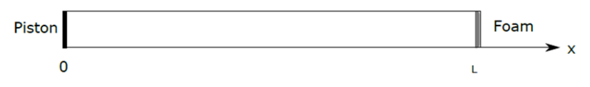

# Acustică și Vibrații: Analiza ecuațiilor Helmholtz în context p-FEM


[toc]


# Introducere

    Pentru a putea aborda probleme avansate de acustică, cum ar fi analiza fenomenelor în vecinătatea materialelor poroase este necesară pe de o parte înțelegerea de bază a fenomenelor dar și existența unui context pentru implementarea analizelor și a măsurătorilor. În acest document vom pleca de la conceptele de bază din acustică și vom defini în paralel cu modelele fizice și matematice o implementare a acestora în Python cu scopul de a oferi mai târziu un prototip pentru experimentare. Conceptele abstracte sunt însoțite de explicații intuitive.

## Definirea problemei

    Vom examina propagarea acustică pentru cazul unidimensional. Problema dată este formată dintr-un tub care are un excitator în partea stângă (exemplu: piston) și un material absorbant în partea dreaptă.



    Propagarea undelor acustice aici este guvernată de ecuația undei în domeniul timpului din care se poate deriva, în domeniul frecvențelor ecuația diferențială Helmholtz: $\nabla^2u+k^2u=0$ peste $\Omega$ unde:


$\nabla$ este operatorul nabla care denotă pentru funcțiile unidimensionale prima derivată iar pentru funcțiile multidimensionale un gradient în câmpul vectorial respectiv. În cazul nostru, $\nabla^2$ este cunoscut sub numele de **Laplacian** și denotă a doua derivată pentru funcții unidimensionale respectiv divergența gradientului funcții pentru dimensiuni mai mari de 1. Practic $\nabla^2u$ este o formă scurtă de a spune *toate derivatele parțiale ale tuturor dimensiunilor spațiale pentru funcția $u$*.

$u$ este necunoscuta; în cazul nostru este presiunea acustică generată de undă. În general, în ecuațiile undei, $u$ depinde atât de timp cât și de spațiu. Ecuațiile Helmholtz însă definesc necunoscuta $u$ în funcție de spațiu pentru fiecare frecvență ceea ce permite exclusiv o analiză armonică.

$k$ este repetiția spațială a undelor (engleză: wavenumber) și reprezintă $\frac{\omega}{c_0}$ unde $\omega$ este frecvența (dacă $\frac{1}{T}$ este perioada atunci $\omega = \frac{2\pi}{T}$) și $c_0$ este viteza sunetului.

$\Omega$ este domeniul ecuației, adică exact domeniul acustic; pentru cazul nostru reprezintă fluidul din tub.


> **Intuitiv** 
> 
> Derivarea ecuației undelor pentru domeniul frecvențelor nu este abordată aici; totuși putem trage niște concluzii simple. Pentru început, este util să diferențiem particulele din fluid de undele acustice. 
> 
> Chiar dacă o undă poate călători de la un punct la altul (ex: de la boxă la urechea noastră) particulele din aer nu fac asta. Efectiv, moleculele care sunt lovite de vibrația boxei nu ajung în urechea noastră. Ele au o mișcare oscilatorie în jurul unui punct de echilibru. Asemănător unei mulțimi de oameni la un concert, dacă este destul de aglomerat și cineva împinge oamenii din jur, mișcarea respectivă se va *propaga* prin mulțime dar oamenii rămân la locul lor.
> 
> Când vorbim de frecvențe în domeniul undelor este util să vizualizăm frecvența ca *numărul de oscilații a unor puncte într-o secundă*. Pentru particulele de mai sus, de câte ori se mișcă ele din punctul de echilibru până într-un punct **de maxim** într-o singură secundă? Aici avem frecvența. 
> 
> Pentru lungimea de undă, este mult mai simplu, reprezintă doar distanța dintre acele puncte de maxim. 
> 
> Toate aceste concepte sunt foarte elegant capturate de ecuația Helmholtz. Avem $k$ care ne face un raport între frecvență (deci oscilația) și viteza efectivă a undei acustice și reprezintă numărul de oscilații într-un metru. Pentru că sunetul este creat de diferențe de presiune în fluid, putem concluziona că sunetele diferă pe măsură ce diferențele de presiune sunt mai dese (frecvența undei) sau mai apropiate (lungime de undă). Deci și presiunile sunt direct legate de frecvențe și lungimi de undă. Lungimea de undă este legată de viteza de propagare $c_0$ iar acest lucru este capturat per total în ecuație cu $k$ și $u$. Cu cât lungimea de undă acoperă o distanță mai mare (definită $\frac{1}{m}$) cu atât presiune este mai mică și vice-versa.
> 
> Termenul $\nabla^2u$ este poate mai criptic dar e ușor observabil în realitate. Când aruncăm o piatră într-un lac, apar cercuri. Practic la suprafața apei există o deplasare. Dacă piatra este mică, cercurile se vor propaga încet spre margini. Dacă piatra este mare, cercurile se vor propaga repede către margini. Operatorul Laplacian exact asta măsoară. Când are o valoare mare orice energie tinde să se *extindă* repede. Când are o valoare mică, se va extinde încet. Ca o medie a accelerației omnidirecționale.
> 
> La echilibru, cu cât undele se propagă mai repede cu atât primul termen o să fie mai mic iar al doilea termen (presiunea) mai mare. Cu cât presiunile sunt mai mici cu atât propagarea se face mai încet. Dacă o frunză cade în apă, cercurile se mișcă încet dar sunt de asemenea de înălțime mică; dacă sărim în apă însă, cercurile se mișcă repede dar și înălțimea lor este mai mare. Asta modelează ecuația Helmholtz.
> 
> Dacă diferența dintre ele nu este $0$ atunci înseamnă că sistemul nu este la echilibru; pentru diferența pozitivă există o forță externă care adaugă energie în sistem, pentru diferență negativă există o zonă externă care trage energie din sistem. Acest lucru îl vom modela mai departe, pornind de la ecuația de echilibru, folosind condiții la limită.


Pentru condițiile la limită, vrem să modelăm pistonul care adaugă energie în sistem ca o excitație oscilatorie și materialul absorbant care scoate energie din sistem. Vom descoperi mai departe că modelarea matematică a acestor două fenomene fizice poate fi obținută cu condiții la limită de tip Neumann respectiv Robin.


### Condiția de frontieră Neumann

Forma generală a acestei condiții este:

$$
\frac{\partial{u}}{\partial{n}}(x) = f
$$

    Formularea ne spune că derivata funcției $u$ pe normala $n$ în punctul $x$ trebuie să fie egală cu o funcție impusă de noi. Condiția pe care vrem să o impunem este ca punctul $x=0$ să fie egală cu viteza oscilatorie a pistonului. Ca să aflăm ce formă are funcția $f$ ne vom uita la ecuația conservării masei într-un fluid:

$$
\rho_0 \frac{\partial{\nu(x, t)}}{\partial{t}} + \nabla{u(x,t)} = 0
$$

Derivata vitezei în fluid este direct legată de gradientul spațial de presiune din acel fluid. Avem nevoie de această condiție în domeniul frecvenței prin urmare:

$$
\mathcal{F}\{ -\rho_0\frac{\partial{v}}{\partial{t}} \} = \nabla u(x, w)
$$

care este, conform transformatei Fourier:

$$
-j \omega \rho_0 \nu = \nabla u
$$

Noi dorim să impunem condiția pe direcția normalei în punctul $x$ și atunci formularea Neumann devine:

$$
\frac{\partial{u}}{\partial{n}}(0) = -j \omega \rho_0 \nu_n
$$

> **Intuitiv**
> 
> Condițiile la limită sunt aplicate pe marginea domeniului de analiză. Cele mai simple sunt condițiile Dirichlet care sunt folosit adesea pentru modelarea constrângerilor directe (ex: $u(0)=0$). Condițiile Neumann în schimb se referă la derivata necunoscutei. Dacă ne imaginăm o sfoară care oscilează, aplicând o condiție de tip Dirichlet egală cu $0$ la un capăt reprezintă că acel capăt nu se mișcă deloc (are o prindere fixă). Dacă aplicăm o condiție de tip Neumann egală cu $0$  înțelegem că acel capăt se poate mișca dar cu viteză constantă (linear). Spre exemplu dacă ne jucăm cu o sfoară în care forțăm o mișcare de oscilație, dacă una din mâini stă fixă, avem condiția Dirichlet. Dacă una din mâine stă la orizontală dar se mișcă sus-jos în mod constant avem condiția Neumann.
> 
> Interactiv se poate observa fenomenul într-o aplicație a universității din Colorado: [Wave on a String.](https://phet.colorado.edu/sims/html/wave-on-a-string/latest/wave-on-a-string_en.html)
> 
> Pentru setarea de oscilație, dacă folosim "Fixed End" avem condiție de frontieră tip Dirichlet (fără mișcare);
> 
> Dacă folosim "Loose End" avem o condiție tip Neumann (mișcare $\pm x$ dar constrânsă);
> 
> Dacă folosim "No End" avem o condiție de tip Robin cu propagare (nici o constrângere).
> 
> 
> 
> Forțând o condiție la limită de tip Neumann efectiv obținem un răspuns forțat în domeniul acustic. Dacă știm oscilația pistonului și definim că la limita de $x=0$ există o condiție de tip Neumann care este egală cu viteză de oscilație din piston, efectiv avem o situație de introducere de energie în sistem, deoarece este o mișcare constrânsă, prin urmare modelarea fizică a pistonului este obținută elegant prin condiția la limită aleasă.


### Condiția de frontieră Robin

    La celălalt capăt dorim să modelăm o relație de admitanță. Condițiile la limită de tip Robin sunt capabile de a modela stări de echilibru. Asta este obținută printr-o combinație de condiție Neumann respectiv Dirichlet. Dacă în cazul Neumann definim valoarea pe care vrem să o aibe derivata necunoscutei iar în cazul Dirichlet definit valoarea pe care vrem să o aibe necunoscuta, formularea Robin ne permite definirea unei combinații lineare între derivată și necunoscută:

$$
a \frac{\partial{u}}{\partial{n}} + b u = f
$$

    O întrebare interesantă ar fi de ce condiția Robin poate modela reflecția sau absorbția acustică și ce formă ar trebui noi să îi dăm? Pentru răspuns vom deriva modelul matematic pentru absorbție pornind, din nou, de la ecuația conservării masei, dar de data această o vom scrie doar pentru partea de domeniu de la frontieră:

$$
\frac{\partial u}{\partial n} = - \rho_0 \frac{\partial \nu}{\partial t} \cdot n
$$

    În continuare, folosim $n$ pentru a nota direcția normală pe frontiera domeniului de calcul. Atunci când vorbim de absorbție este clar, din punct de vedere intuitiv, că afectăm legile de conservare dacă nu luăm în calcul zona exterioară; asta automat implică adaptarea formulei de mai sus pentru a modela corect energia disipată din sistem, iar acest lucru îl vom face prin a adăuga un factor de absorbție lângă viteză:

$$
\frac{\partial u}{\partial n} = - \rho_0 \frac{\partial \nu}{\partial t} \cdot n + R \cdot \nabla \nu
$$

    Avem pe lângă legea conservării, cu semn opus, un oarecare factor aplicat direct asupra gradientului de viteză. Deci afectăm echilibrul de energie astfel încât să considerăm radiațiile acustice. 

Ca și notă, o serie foarte largă de fenomene la limitele domeniului de calcul pot fi modelate începând de la alterarea acestei formule de echilibru. Continuăm să rescriem $\nabla \nu$ folosind conservarea masei:

$$
\nabla \nu = -\frac{1}{\rho_0 c^2} \frac{\partial u}{\partial t}
$$

o echivalență pe care o putem înlocui:

$$
\frac{\partial u}{\partial n} = - \rho_0 \frac{\partial \nu}{\partial t} \cdot n - R  \frac{1}{\rho_0 c^2} \frac{\partial u}{\partial t}
$$

Definim factorul $\beta$ sub forma:

$$
\beta = \frac{R}{\rho_0 c}
$$


Și obținem ecuația de echilibru cu absorbție în domeniul timpului:

$$
\frac{\partial u}{\partial n} = - \rho_0 \frac{\partial \nu}{\partial t} \cdot n - \beta \cdot \frac{1}{c} \frac{\partial u}{\partial t}
$$

    Observăm că ecuația conține și derivata vitezei în raport cu timpul dar din considerente de modelare noi dorim să păstrăm zona absorbantă statică. Putem spune că este o zonă quasi-rigidă; cu toate că există clar o presiune și o viteză nu vom considera că acest lucru este aplicabil peretelui absorbant. Pe baza acestui considerent vom face o simplificare aplicabilă doar zonei absorbante, unde considerăm $\nu=0$:

$$
\frac{\partial u}{\partial n} = - \beta \cdot \frac{1}{c} \frac{\partial u}{\partial t}
$$

Pentru ecuația obținută vom trece în domeniul frecvenței pentru a o putea aplica formulării Helmholtz:

$$
\frac{\partial u}{\partial n} = - \beta j \omega \frac{1}{c} u
$$

Simplificăm notarea definind $k = \frac{\omega}{c}$ și ajungem la ecuația:

$$
\frac{\partial u}{\partial n} + jk \beta u = 0
$$

Care într-adevăr este exact în forma de condiție Robin și, conform demonstrației anterioare, poate modela factorul de reflecție respectiv refracție. Noi impunem această condiție doar pentru $x=L$ deci:

$$
\frac{\partial u}{\partial n}(L) + jk \beta u(L) = 0
$$


> **Intuitiv**
> 
> Observăm din formula obținută că putem controla admitanța sau reflectivitatea cu factorul $\beta$. Deoarece $\beta$ este definit ca $\frac{R}{\rho c_0}$, atunci când $R = \rho c_0$ avem un factor de $1$ care reprezintă absorbție completă. De exemplu, un geam deschis are absorbție completă pentru că orice energie acustică ajunsă acolo continuă la nesfârșit. Dacă $R=0$ atunci și $\beta = 0$ iar în acest caz avem reflectivitate completă deoarece nimic nu poate trece peste acea limită. Cu cât $\beta$ este mai mare pe pereții apartamentele noastre, cu atât sunt mai supărați vecinii când ascultăm muzică tare.
> 
> Pe scurt, $\beta=0$ este reflecție ideală iar $\beta =1$ este absorbție (sau propagare) ideală. Prin urmare este un factor foarte util de a defini, procentual, ce nivel de reflecție / absorbție dorim (în engleză: admittance/impedance).
> 
> De menționat este că absorbția sau propagarea reprezintă același lucru din punct de vedere al sistemului închis, dar au comportamente diferite. Asemănarea este că ambele fenomene reduc reflecția undelor acustice, dar unul din ele le absoarbe direct iar celălalt le lasă să treacă mai departe. 
> 
> Formularea noastră matematică modelează, din punct de vedere sistem închis, ambele fenomene (absorbție completă și propagare ideală) cu $\beta = 1$; vom observa mai târziu metode matematice de modelare individuală a celor două cazuri. Pentru moment rămânem interesați de ce se întâmplă în interiorul domeniul și abstractizăm *daunele* externe.


### Sumarul modelului matematic

Pentru ecuația diferențială:

$$
\nabla^2u+k^2u=0, over \Omega 
$$

cu condițiile la limită:

$$
\frac{\partial{u}}{\partial{n}}(0) = -j \omega \rho_0 \nu_n
$$

$$
\frac{\partial u}{\partial n}(L) + jk \beta u(L) = 0
$$


dorim să calculăm analitic, respectiv folosind metoda elementului finit, soluția $u(x, \omega)$.


## Soluția analitică

     Pentru problema definită, dacă impunem ca viteza impusă de piston să fie egală cu $\nu=\frac{1}{\rho_c c_0}$ și factorul de absorbție de la punctul $x=L$ să fie $\beta = 1$ atunci, conform teoriei de derivare a ecuației Helmholtz, soluția este:

$$
u(x, \omega)= e^{-i k x}
$$

pentru $k=\frac{\omega}{c_0}$. De notat este că soluția este definită prin convenție cu exponentul negativ; un exponent pozitiv este de asemenea o soluție validă. Semnul exponentului reprezintă direcția de radiație. Aici am ales să fie de la stânga la dreapta considerând modelul matematic ales.

    Derivarea soluției se obține prin derivarea ecuației Helmholtz care nu este abordată în acest document. Trecerea din ecuația în timp a propagării undelor în ecuația Helmholtz în frecvență implică definirea soluțiilor posibile sub formă exponențială; alegerea datelor de intrare în mod unitar, evident, generează soluția exponențial armonică ideală conform teoriei transformatei Fourier. Alegerea valorii $\nu$ ca inversă de $\rho c_0$ este intenționat făcută pentru a anula factorii de material din ecuația conservării masei iar alegerea valorii $\beta$ ca perfect radiantă evită complet influențele reflectante. Mai târziu în document vom analiza și un caz realistic de propagare unde soluția analitică nu va putea corect modela datorită simplificării matematice.


## Discretizare

    Dacă dorim o rezolvare cu metoda elementelor finite avem nevoie de o trecere din spațiul continuu într-un spațiu discret (finit). Ecuația diferențială este definită peste domeniul continuu spațial $\Omega$ deci noi vom discretiza spațiul în zone definite de elemente ideale de tip bară. Desigur, această tehnică implică automat o aproximare dar permite rezolvarea ecuațiilor diferențiale folosind algebră lineară, o tehnică accesibilă calculatoarelor.

    Considerând tubul nostru din problemă care are originea în $x_0=0$ și capătul în $x_n = L$, vom împărți spațiul în $n$ elemente egale de tip bară. Din procesul de discretizare vom obține, și vorbi în continuare, de elemente și noduri.

    Pentru o bară de lungime $L$ dorim o discretizare în $n$ elemente; implementarea pentru cazul 1D este:

```python
# Creates a mesh for a duct from x=0 to x=L with n elements;
# 
# length (L): the length of the duct
# num_elements (n): number of elements to split the domain into
# returns: a 1D mesh contains nodes (1D coordinates) and elements (start/end node)
 def create_1d_mesh(length, num_elements):
    num_nodes = num_elements + 1
    coordinates = np.linspace(0, length, num_nodes)

    mesh = Mesh1d()
    mesh.node_coordinates = [Coord1d(x) for x in coordinates]
    for i in range(0, len(coordinates)-1):
        mesh.elements.append(Element1d(i, i+1))
    return mesh
```

    Pentru implementarea curentă vom discretiza în elemente egală cu toate că nu avem nici o constrângere de a avea aceeași dimensiune pentru fiecare element.

    Spațiu este discretizat în $n+1$ noduri și fiecare element este definit de două noduri consecutive. Urmează rezolvarea ecuațiilor în fiecare element după care extinderea soluției pe tot domeniul $\Omega$.


> **Intuitiv**
> 
> Prin procesul de discretizare simplificăm modelele matematice dar, în general, pierdem acuratețe. Motivul principal pentru care discretizăm problemele matematice (sau inginerești) este că, pe de o parte, pentru probleme complicate devin efectiv imposibil de rezolvat analitic iar pe de cealaltă parte problemele definite în spațiu continuu nu pot fi ușor implementate pe calculator.
> 
> Prin discretizare redefinim orice integrală $\int{f(x)dx}$ ca $\sum_{x=0}^{n}{f(x)}$ și orice derivată $f'(x)$ ca $f(x) - f(x-\epsilon)$. Efectiv toate calculele diferențiale devin calcule lineare prin urmare pot fi, mai mult sau mai puțin, rezolvate prin tehnici de algebră lineară, unde calculatoarele excelează.
> 
> Partea complicată apare atunci când acuratețea este de departe satisfăcătoare, situații în care fie folosim modele matematice adaptate problemei pentru definirea fenomenelor de interes, fie aplicăm diverși algoritmi particulari cu scopul de a îmbunătății rezultatele. În cazul de față vom explora folosirea metodei p-FEM pentru a obține acuratețea dorită.


## Funcții de formă

    Odată discretizat un domeniu continuu nu dispare nevoia de a obține informații pentru orice $x \in \Omega $; avem totuși nevoie să analizăm orice punct din domeniul de interes. Calculele le vom face doar pe nodurile discretizate, astfel încât soluția noastră nu va fi continuă ci va conține o valoare pentru fiecare nod (sau element) din modelul simplificat dar rezultatele am dori să le obținem oriunde în domeniu.

    Din cauza acestui motiv este nevoie de introducerea unui concept de funcții de formă; pentru fiecare tip de element pe care îl folosim în discretizare dorim să putem interpola orice valoare la orice punct din element.

    În cazul nostru, pentru elemente simple de tip bară, funcțiile de formă sunt destul de simple. Dacă avem un element între coordonatele $[-1, 1]$ cu valorile $u(-1)$ la coordonate $-1$ și $u(1)$ la coordonata $1$ atunci putem aplica o tehnică de interpolare lineară pentru a afla valoarea la orice $x \in [-1, 1]$. Dacă $x=0$ atunci avem $u(x) = \frac{1}{2}u(-1) + \frac{1}{2}u(1)$. În formă generală, interpolarea folosind funcțiile de formă este:

$$
u(x) = \sum_{n=0}^{K}{N_n(x)u(n)}
$$

iar pentru elementele de tip bară (în interval $[-1, 1]$):

$$
u(x) = N_0(x) \cdot u(-1) + N_1(x) \cdot u(1)
$$

unde:

$$
N_0(x) = \frac{1-x}{2}
$$

$$
N_1(x) = \frac{1+x}{2}
$$

    Formulele sunt valide **doar** pentru intervalul definit $[-1, 1]$. Definirea elementelor într-un interval prestabili este în final o tehnică de optimizare a calculelor; dacă știm apriori forma elementului putem pre-defini toate funcțiile de formă fără a fi necesar în a le calcula, prin urmare putem obține timpi mai buni de rezolvare a problemei date. 

    Desigur, în realitate nu vom avea toate elementele între $[-1, 1]$ prin urmare avem nevoie și de o metodă de transformare de la un element definit în coordonate reale într-un interval arbitrar $[a, b]$ la un element ideal $[-1, 1]$ și vice-versa. Se întâmplă că exact funcțiile de formă pot face această interpolare. Dacă considerăm $a$ și $b$ ca fiind valori putem aplica funcția de formă pentru a interpolare în intervalul $[-1, 1]$. Adică $u(-1) = a$ și $u(1)=b$, deci dacă vrem să obținem coordonatele reale (între $[a, b]$) pentru orice $x \in [-1, 1]$ putem interpola folosind valorile mai sus definite. În sens invers, dacă dorim să obținem orice coordonată ideală între $[-1, 1]$ pentru o coordonată reală între $[a, b]$ interpolăm pentru $u(-1) = -1$ și $u(1) = 1$.

    Problema pare mai complicată în dimensiuni mai mari (2D pentru elemente de tip triunghi sau pătrat, 3D pentru cuburi, trapezoide etc) dar logica rămâne aceeași. Orice element ideal este definit într-un interval prestabili (aici $[-1, 1]$ pentru simplitatea formulelor, dar poate fi arbitrar ales) și este reprezentat de combinație lineară a funcțiilor de formă corespunzătoare fiecărui nod. 

    De notat este că funcțiile de formă fac **o interpolare lineară** deci este absolut imposibil de a reprezentat o funcție de ordin înalt într-un astfel de element; de exemplu funcția $f(x) = sin(x)$ **nu poate fi reprezentată** folosind funcții de formă lineară. 


> **Intuitiv**
> 
> Pentru o linie trasă între coordonatele 0 și 10, dacă cineva întreabă *"ce coordonată este în centrul liniei?"*, răspunsul ar fi evident, 5. Dar de ce? Dacă întrebarea era *"ce coordonată este la o cincime de la început?"* poate răspunsul ar părea mai dificil dar cumva, intuitiv, știm că este $\frac{1}{5}10$ adică 2. Dar dacă linia este între coordonatele $-2.34$ și $17.21$? Parcă devine puțin mai greu să găsim un răspuns. Dar dacă nu e o linie ci un pătrat? Avem nevoie de o metodă clară de a putea găsi indiferent de coordonate sau **formă** unde poate fi o anume locație.
> 
> Asta este exact ce fac funcțiile de formă. Pot să calculeze, indiferent de câte noduri sau ce valori avem, pentru orice locație, ce valoare ar fi acolo. Mai matematic, definesc efectiv **forma** pe care un element o are folosind funcții continue. 


### Funcții de formă simple


### Funcții de formă ierarhice


## Tehnici de integrare în domeniul discret: Gauss-Legendre Quadrature


## Matricile de masă și rigiditate pentru elemente acustice


## Asamblarea sistemului global


## Aplicarea condițiilor la limită


### Condiție la limită: aplicarea impedanței


### Condiție la limită: definirea excitații


## Rezolvarea sistemului linear


## Răspunsul forțat: corelare


## Analiza convergenței pentru metoda p-FEM


## Analiza convergenței pentru metoda h-FEM


## Analiza cazului reflectiv


## Analiză modală: frecvențele de rezonanță


